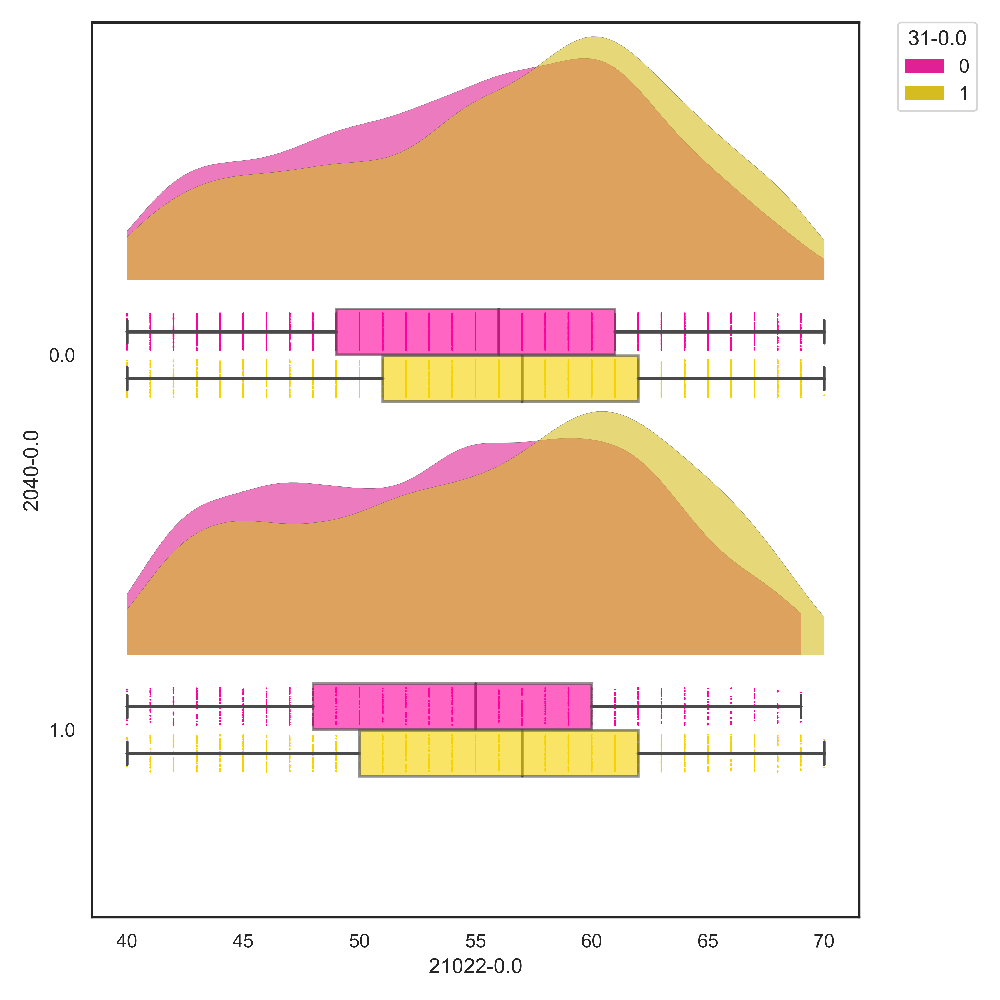

# Project for BrainHack School 2020

Team Contributors: Hannah Kiesow & Elise Douard 

## Introduction

Hi! I am a second year PhD student studying computational neuroscience, working in the lab of Dr. Danilo Bzdok at McGill University. My research interests are in social cognition, and I am extremely fascinated with social interaction. My lab focuses on big data in neuroscience using data-driven methods. For my current projects, I mainly use Bayesian probabilistic modelling to analyze my data, using the UK BioBank, one of the world's largest biomedical databases. However I am starting to branch into machine learning and am super eager to apply ML methods in neuroimaging. My experience so far has been working mostly with structural MRI images, but I would love to branch out and work with other neuroimaging modalities. 

 
 
Looking forward to collaborating with you! 
 
twitter: @hannahmaykiesow

## Project Definition 

# Goals: 
- I would ideally like to focus on using machine learning techniques. I would definitely like to focus on getting intuitions behind different ML techniques, and perhaps try out different ensemble methods for prediction

- I also would like to get to know the nilearn API more in depth, especially working with 
the different atlases for feature engineering. 

- Lastly, I think visualization is an extremely important skill to invest in. That's why I want to explore other visualization tools using python such as bokeh or ptit prince. 

### Progress overview

- So far, I am learning Canonical Correlation Analysis (CCA) so that I can first create my features using two atlases, the Social Brain Atlas and the Harvard Oxford Atlas

### Tools 

- Nilearn (working with different atlases)
- Machine Learning (sklearn)
- Visualization (ptit prince, seaborn, bokeh)

### Data

- UK Biobank data (~10,000 person release)

###  Deliverables

At the end of this project, we will have:
 - a better understanding and intuition of several machine learning algorithms suitable for neuroimaging
 - a deeper understanding of feature engineering via atlases 
 - hopefully made a pretty figure :D 

### Tools I learned during this project

- Canonical Correlation Analysis 

### Results 

## Conclusion and acknowledgement